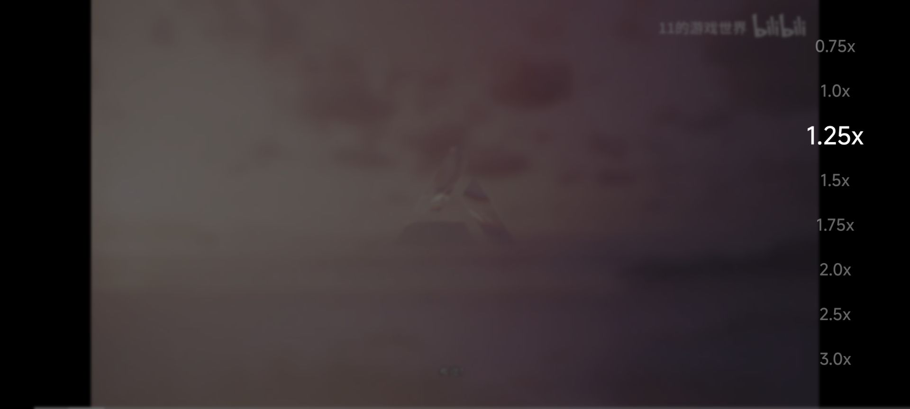
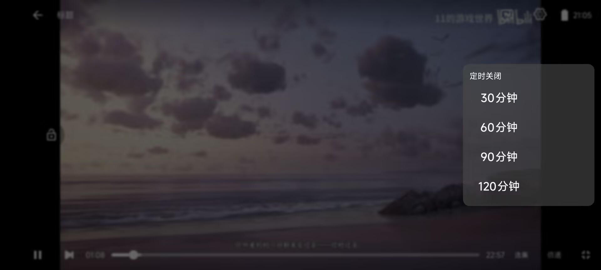
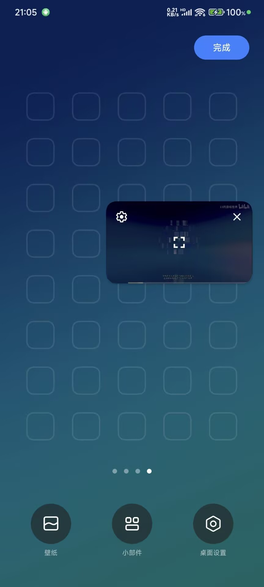

### UaoanDKVideoPlayer

> 二改DK播放器，内置下一集按钮、选集按钮、投屏按钮，功能菜单弹窗、竖屏全屏、倍速功能、画面比例更改、长按倍速、定时关闭软件、跳过片头、跳过片尾、小窗播放、隐藏进度条


###  [DK播放器APK下载](https://github.com/uaoan/UaoanDKVideoPlayer/releases/download/1.0.0/app-release.apk)


### 集成
**1.在 project 的 build.gradle 文件中找到 allprojects{} 代码块添加以下代码：**

```
allprojects {
    repositories {
        google()
        jcenter()
        maven { url 'https://jitpack.io' }      //增加 jitPack Maven 仓库
    }
}
```
**在 app 的 build.gradle 文件中找到 dependencies{} 代码块，并在其中加入以下语句：**

```
implementation 'com.github.uaoan:UaoanDKVideoPlayer:1.0.2'
```


###  **简单使用**

**添加布局**

```
 <com.uaoanlao.player.DkPlayerView
        android:id="@+id/videoView"
        android:layout_width="match_parent"
        android:layout_height="200dp" />
```

**设置视频地址、控制器等**

```
videoView.setUrl(URL); //设置视频地址
UaoanStandardVideoController controller = new UaoanStandardVideoController(this, videoView);
controller.addDefaultControlComponent("斗破苍穹", false);
controller.setBottomProgress(true); //设置显示底部进度条
videoView.setVideoController(controller); //设置控制器
videoView.start(); //开始播放，不调用则不自动播放
```

**在Activity中**


```
@Override
    protected void onPause() {
        super.onPause();
        //暂停播放
        videoView.onVideoPause();
    }

    @Override
    protected void onResume() {
        super.onResume();
        //继续播放
        videoView.onVideoResume();
    }

    @Override
    protected void onDestroy() {
        super.onDestroy();
        //销毁
        videoView.onVideoReleaseAllVideos();
    }


    @Override
    public void onBackPressed() {
        //返回
        if (!videoView.onBackPressed()) {
            super.onBackPressed();
        }
    }

   
```

**在AndroidManifest.xml中**


```
 <activity
    android:name=".PlayerActivity"
    android:exported="true"
    android:screenOrientation="portrait"
    android:supportsPictureInPicture="true"
    android:configChanges="screenSize|smallestScreenSize|screenLayout|orientation"
    android:resizeableActivity="true" />
```


### 创建接口调用类

```
UaoanInterFace face=new UaoanInterFace();

//显示投屏按钮并设置点击事件
face.setScreenTvOnClickListener(new UaoanInterFace.ScreenTvOnClickListener() {
@Override
public void onClick(View v) {
Toast.makeText(MainActivity.this, "点击了投屏", Toast.LENGTH_SHORT).show();
}
});

//显示下一集按钮并设置点击事件
face.setPlayDownOnClickListener(new UaoanInterFace.PlayDownOnClickListener() {
@Override
public void onClick(View v) {
Toast.makeText(MainActivity.this, "点击了下一集", Toast.LENGTH_SHORT).show();
}
});

//显示选集按钮并设置点击事件
face.setPlayListOnClickListener(new UaoanInterFace.PlayListOnClickListener() {
@Override
public void onClick(View v) {
Toast.makeText(MainActivity.this, "点击了选集", Toast.LENGTH_SHORT).show();
}
});

//显示竖屏全屏按钮
face.setFullScreenVertical(true);

```


```

//实时监听播放
 videoView.setOnProgressListener(new DkPlayerView.OnProgressListener() {
   @Override
    public void onProgress() {

       }
    });

//继续上次播放位置
videoView.setKeepVideoPlaying()

//播放完成
videoView.setOnPlayComplete(new DkPlayerView.OnPlayComplete() {
@Override
public void complete() {

            }
        });
```

### 投屏
**投屏使用代码**


```
new Screen().setStaerActivity(MainActivity.this)
            .setName("斗破苍穹") 
            .setUrl("https://s.xlzys.com/play/9avDmPgd/index.m3u8")
            .setImageUrl("http://i0.hdslb.com/bfs/article/96fa4320db5115711c8c30afaff936910595d336.png")
            .show();
```

**————————————————————————————————————————————————————————————————————————**


### [更多方法请点击前往 >](https://github.com/Doikki/DKVideoPlayer/wiki/API)


**————————————————————————————————————————————————————————————————————————**









